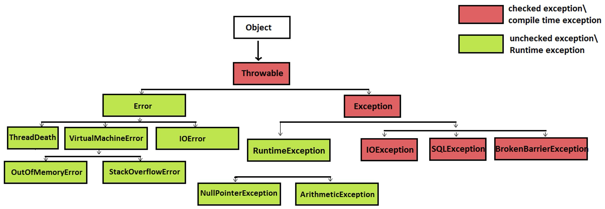

# 2026-09-04

## Exceptions

- **Exception**: an event that occurs that disrupts the normal flow of program execution.
  - Compile Time errors: errors that prevent the compiler from building the program.
  - Runtime errors: errors that halt a program as it runs.
  - Logical errors: errors that may not stop the program or produce anything to the error output, but can still negatively impact the application.
- **Checked** (`Exception`): The code will not compile unless handled or declared. Handle with try-catch.
  - Use this only if the caller of your method can reasonably be expected to recover or take an alternative action when the error happens.
- **Unchecked** (`RuntimeException`): The compiler does not intervene. Handle by fixing the underlying program logic.
  - Use this for programming errors, invalid arguments, or external errors that the code cannot realistically recover from.
  - It keeps your code clean and avoids forcing other developers to write boilerplate try-catch blocks for errors they can't fix anyway.
- DO NOT extend `Error`:
  - `Error` is reserved for serious system failures (like running out of memory). Application code should never create or throw custom `Error` classes.

## Build Tools

- Java build tools are programs that automate the process of converting Java source code into executable applications by handling tasks such as code compilation, dependency management, automated testing, and software packaging.
- A **classpath** is a list of places where Java looks for classes and other resources our program needs.
  - For example, if we use: `import io.bretty.console.table.TableBuilder;`, our Java program needs to know where to look for the `TableBuilder.class` file.
  - The classpath tells Java where to find it.
  - Some dependencies may be transitive. This is very difficult to manage manually.
  - We’d have to get the right versions of the jar files manually and compiling/running would need to be done manually:
    - `javac -cp "lib/_" -d out src/Main.java`
    - `java -cp "out:lib/_" Main`
  - Instead, Maven handles setting up the classpath for us.

## Apache Maven

- `POM.xml` (Project Object Model): think of this as your Maven project’s instruction manual. It tells Maven:
  - This is a Java project. Here’s its name, version, dependencies, and here is how I want it built.
  - It’s easy to setup Maven projects in most IDEs.
  - In Intellij, just create a Maven project after selecting ‘New Project’.
  - For VS Code – use the command palette to launch the guided process.
- `groupId`: organization/project group; usually a reverse domain
- `artifactId`: name of the project.
- `Version`: our own version scheme we can control; SNAPSHOT suggests it is still in development.
- **Artifact coordinates**: all three of these: `groupId:artifactId:version`.
- The **Maven Central** repository is where libraries live. There are a handful of websites that essentially just add a layer to browse Maven Central.
- A Maven plugin is a collection of executable build functionality that Maven can use to perform tasks. Plugin goals: a specific action a plugin knows how to perform.

## Maven Lifecycle (Phases) [MEMORIZE THESE FOR QC]

- **Validate**: checks that the project is valid and ready to be built.
- **Compile**: compiles your main Java source into bytecode.
- **Test**: compiles your test code and runs your tests.
- **Package**: takes the compiled application and packages it into its distributable format i.e. likely a `.jar`.
- **Verify**: runs checks that verify the packaged project meets additional quality/integration requirements. (e.g. plugins may run integration tests.)
- **Install**: installs your built artifact into your local Maven repository.
- **Deploy**: publishes the artifact to a remote Maven repository.
