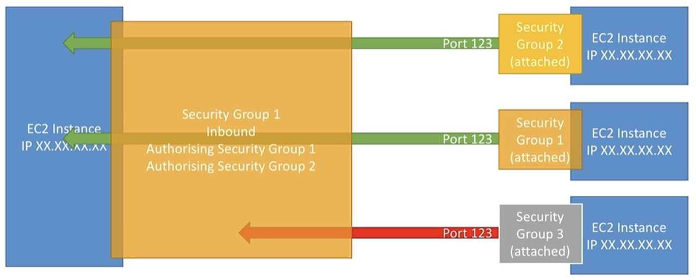

# 2026-09-11

## AWS

- AWS Cloud use cases:
  - Enables you to build sophisticated, scalable applications.
  - Applicable to a diverse set of industries.
  - Enterprise IT, Backup & Storage, Big Data Analytics, Website Hosting, Mobile & Social Apps, Gaming/Game servers
- **AWS Region**: a region is a cluster of data centers.
  - `us-east-1`, `eu-west-2`, etc.
  - Most services are region scoped.
  - Choose based on compliance, latency, and available services.
  - Pricing varies region to region.
- **AWS Availability Zones** (AZ): one or more discrete data centers with redundant power, networking, and connectivity/
  - Each region has 3 or more zones (e.g. us-east-2a, us-east-2b, etc.).
- **AWS Edge Locations**: managed PoP used for content delivery.
- **AWS Points of Presence**: a physical networking site where providers connect its network to users.
- User > ISP > PoP > AWS Backbone (Global Network Layer) > AWS Region.

## Global vs. Region Scoped Services

- Global Services:
  - Identity and Access Management (IAM)
  - Route 53 (DNS Service)
  - CloudFront (Content Delivery Network - CDN)
  - WAF (Web Application Firewall)
- Most AWS services are region-scoped:
  - Amazon EC2 (Infrastructure as a service)
  - Elastic Beanstalk (Platform as a service)
  - Lambda (Function as a service)
  - Rekognition (Software as a service)

## IAM (Identity and Access Management, Global Service)

- **Users & groups**:
  - Root account created by default, shouldn’t be used or shared.
  - Use root account to create other IAM users.
  - Users are people within your organization, and can be grouped.
  - Group only contain users, not other groups.
  - Users don’t have to belong to a group, and users can belong to multiple groups.
- **Policies & permissions**:
  - Users or groups can be assigned to **policies** (JSON format) that define the **permissions** of the users.
  - Apply the **least privilege principle**: don’t give more permissions than a user needs.
  - **Inline policy**: embedded directly into a single IAM identity (a user, group, or role).
- **Account alias**: changes the sign in URL for users, making it more human-friendly and easier to remember.

## Ways to Access AWS

- **AWS Management Console**: protected by MFA + Password.
- **AWS CLI**: protected by access keys.
  - - Enables you to interact w/ AWS services using commands in your CLI.
  - Direct access to public APIs of AWS services.
  - You can develop scripts to manage resources.
  - Alternative to using AWS Management Console.
- **AWS SDK**: for code; protected by access keys.
  - Language-specific APIs (set of libraries).
  - Access & manage AWS services programmatically.
  - JavaScript, Python, PHP, .NET, Ruby, Java, Go, Node.js, C++, etc.
  - Mobile SDKs (Android, iOS).
  - IoT Device SDKs (Embedded C, Arduino, etc.)
- **Access Keys** are generated through the AWS Console.
  - Users manage their own access keys
  - Access keys are secret, don’t share them.
  - **Access Key ID** ≈ username.
  - **Secret Access Key** ≈ password.

## AWS Roles

- Some AWS services will need to perform actions on our behalf.
- We assign permissions to AWS services w/ IAM Roles.
- Common roles:
  - EC2 instance roles.
  - Lambda function roles.
  - Roles for CloudFormation.

## IAM Guidelines & Best Practices

- Don't use the root account except for AWS account setup.
- 1 physical user ⇔ 1 AWS User.
- Assign users to groups & assign policies to groups.
- Create a strong password policy.
- Use and enforce the use of MFA.
- Use roles for giving permissions to AWS services.
- Use access keys for programmatic access (CLI/SDK).
- Never share IAM users & access keys.
- Audit permissions of your account using:
  - **IAM Credentials Report**.
  - **IAM Last Accessed**.

## AWS Summary

- **Users**: mapped to a physical user, has a password for AWS console.
- **Groups**: contains users only.
- **Policies**: JSON document that outlines permissions for users, groups, and roles.
- **Roles**: permissions for EC2 instances or other AWS services.
- **Security**: MFA, password policies.

## Security Groups

- Network security in AWS (virtual firewall)
- Only contain "allow" rules.
- Security groups rules can reference by IP or by security group.
- Regulate: access to ports, authorized IP ranges, ingress, and egress.
- Can be attached to multiple instances (and instances can have multiple security groups).
- Locked down to a specific region / VPC combination.
- Live outside the EC2 (if traffic is blocked, the EC2 will never see it).
- Good to maintain one separate security group for SSH access.
- If your app is not accessible (time out), it’s likely a security group issue.
- If your app gives a "connection refused" error, it’s likely an application error or it’s not launched.
- All inbound traffic is blocked by default.
- All outbound traffic is authorized by default.

## Standard Ports

- `22`: **SSH** (secure shell) – log into a linux instance.
- `21`: **FTP** (file transfer protocol) – upload files into a file share.
- `22`: **SFTP** (secure shell transfer protocol) – upload files using SSH.
- `80`: **HTTP** - access unsecured websites.
- `443`: **HTTPS** – access secured websites.
- `3389`: **RDP** (remote desktop protocol) – log into a windows instance.
- `5432`: **PostgreSQL** (remote desktop protocol) – log into a windows instance.

## RDS (Relational Database Service)

- Collection of services for operating a relational database server in the cloud.
- **Aurora**: fully managed, cloud-native relational database engine built for RDS.
  - Compatible with MySQL & PostgreSQL.
