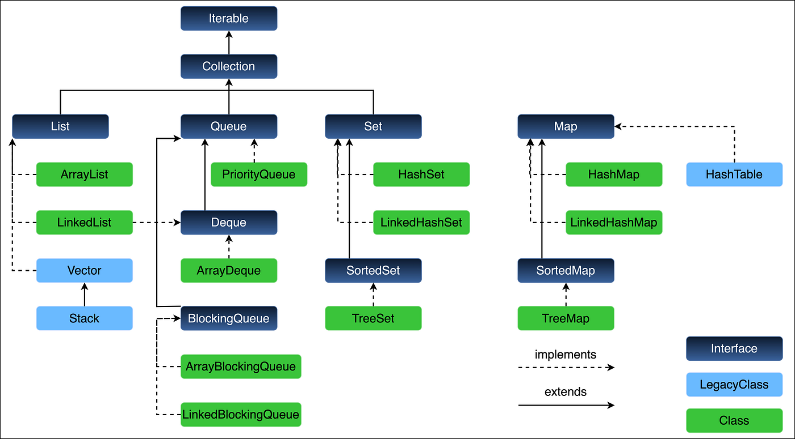

# 2026-09-14

## `Collection` (Interface)

- A collection is an object that stores multiple objects together.
- Collections are accompanied by generics, which tell Java the datatype the collection stores.
- That’s because collections store objects, not primitive types.
- Wrapper classes are provided.
- Collections usually inherit the `Collection` interface, except for `Map`.
- Map is still considered to be part of the Collections API, however.
- Collections from the API are imported from `java.util`.
- Prefer interfaces over concretions:
  - Good: `List<String> names = new ArrayList<>();`
  - Bad: `ArrayList<String> names = new ArrayList<>();`
- All collections have these methods:
  - `add(E e)`
  - `addAll(Collection<? extends E> c)`
  - `remove(Object o)`
  - `removeAll(Collection<?> c)`
  - `retainAll(Collection<?> c)`
  - `clear()`
  - `size()`
  - `isEmpty()`
  - `contains(Object o)`
  - `containsAll(Collection<?> c)`
  - `iterator()`
  - `stream()`
  - `toArray()`



## `Iterable` (Interface)

- Many collections implement the `Iterable` interface.
- This defines data structures that can be traversed using the `.iterator()` method, which returns an `Iterator` data type.
- These types of collections can be traversed using enhanced for loop syntax.

```java
List<String> names = new ArrayList<>();
Iterator<String> it = names.iterator();
while (it.hasNext())
    System.out.print(it.next());
```

## `List` (Interface)

- Lists are ordered & allow duplicate values.
- `ArrayList<E>` methods:
  - `add(int index, E e)`
  - `addAll(int index, Collection<? extends E> c)`
  - `set(int index, E e)`
  - `get(int index)`
  - `indexOf(Object o)`
  - `lastIndexOf(Object o)`

## `LinkedList` (Class)

- Stores elements via connected nodes.
- They are doubly linked in Java (each node has private properties that refer to the previous and next nodes).

```java
List<Integer> l = new LinkedList<>();
Queue<Integer> q = new LinkedList<>();
Deque<Integer> d = new LinkedList<>();
```

#### `Queue` (Interface)

| Operation   | Throws Exception | No Exception |
| :---------- | :--------------- | :----------- |
| **Insert**  | `add(E e)`       | `offer(E e)` |
| **Remove**  | `remove()`       | `poll()`     |
| **Examine** | `element()`      | `peek()`     |

- `add(E e)`: Inserts element into queue. Throws `IllegalStateException` if no space is available.
- `offer(E e)`: Inserts element into queue. Returns `false` if capacity is full.
- `remove()`: Retrieves and removes the head of queue. Throws `NoSuchElementException` if empty.
- `poll()`: Retrieves and removes the head of queue. Returns `null` if empty.
- `element()`: Retrieves, but does not remove, the head of queue. Throws `NoSuchElementException` if empty.
- `peek()`: Retrieves, but does not remove, the head of queue. Returns `null` if empty.

#### `Deque` (Interface)

- Pronounced as "deck".
- Short for double-ended queue.
- Extends from `Queue`, so we get all its implementation + methods from `Deque`.
- **ArrayDeque**:
  - `ArrayDeque`: resizable-array implementation of the `Deque` interface.
    - Offers faster iteration, lower memory overhead, and $O(1)$ amortized time for insertions and deletions at both ends.
    - Cannot store null elements and requires occasional array resizing.
  - `LinkedList`: doubly-linked list implementation of `Deque` interface.
    - Allocates memory dynamically for each node w/o resizing overhead and supports null elements.
    - Consumes more memory per element due to node pointers and suffers from poorer cache locality.
- Head operations:
  - `addFirst(E e)`: Inserts at front. Throws exception if full.
  - `offerFirst(E e)`: Inserts at front. Returns `false` if full.
  - `removeFirst()`: Removes and returns front element. Throws `NoSuchElementException` if empty.
  - `pollFirst()`: Removes and returns front element. Returns `null` if empty.
  - `getFirst()`: Returns front element without removing. Throws `NoSuchElementException` if empty.
  - `peekFirst()`: Returns front element without removing. Returns `null` if empty.
- Tail operations:
  - `addLast(E e)`: Inserts at end. Throws exception if full.
  - `offerLast(E e)`: Inserts at end. Returns `false` if full.
  - `removeLast()`: Removes and returns end element. Throws `NoSuchElementException` if empty.
  - `pollLast()`: Removes and returns end element. Returns `null` if empty.
  - `getLast()`: Returns end element without removing. Throws `NoSuchElementException` if empty.
  - `peekLast()`: Returns end element without removing. Returns `null` if empty.
- Stack operations (LIFO):
  - `push(E e)`: Pushes element onto stack (equivalent to `addFirst(e)`).
  - `pop()`: Pops element from stack (equivalent to `removeFirst()`).

## `Set` (Interface)

- Not indexed.
- Stores unique elements.
- Classes:
  - `HashSet`: unsorted.
  - `LikedHashSet`: retains insertion order.
  - `TreeSet`: sorted.

## `Map` (Interface)

- Stores key-value pairs (`Map.Entry<K, V>`).
- Keys are strictly unique.
- Classes:
  - `HashMap`: unsorted.
  - `LinkedHashMap`: retains insertion order.
  - `TreeMap`: sorted by keys.
- Basic modifications:
  - `put(K key, V value)`: Maps `key` to `value`. Overwrites previous value if key exists and returns old value.
  - `putAll(Map<? extends K, ? extends V> m)`: Copies all key-value mappings from `m`.
  - `putIfAbsent(K key, V value)`: Puts `value` if key is not already mapped or mapped to `null`.
  - `remove(Object key)`: Removes key-value mapping for `key` and returns old value.
  - `remove(Object key, Object value)`: Removes key only if mapped to exact specified value.
  - `replace(K key, V value)`: Replaces entry for `key` only if currently mapped to a value.
  - `replace(K key, V oldValue, V newValue)`: Replaces entry for `key` only if currently mapped to `oldValue`.
  - `clear()`: Removes all mappings.
- Lookups & inspection:
  - `get(Object key)`: Returns value mapped to `key`, or `null` if not found.
  - `getOrDefault(Object key, V defaultValue)`: Returns value mapped to `key`, or `defaultValue` if key missing.
  - `containsKey(Object key)`: Returns `true` if map contains the specified key.
  - `containsValue(Object value)`: Returns `true` if map maps one or more keys to the value.
  - `size()`: Returns number of key-value mappings.
  - `isEmpty()`: Returns `true` if map contains no entries.

```java
Map<Integer, String> students = new HashMap<>();
students.put(101, "Alice");
students.put(102, "Bob");

for (Map.Entry<Integer, String> entry : students.entrySet())
    out.printf("%s %s", entry.getKey(), entry.getValue());

for (Integer key : students.keySet())
    out.println(key);

for (String value : students.values())
    out.println(value);
```

## `Comparable` & `Comparator` Interfaces

#### `java.lang.Comparable`

- Provides the natural ordering for a class.
- Implementing it allows objects of that class to compare themselves to another instance of the same class.
- **Key Method**: `int compareTo(T o)`.
- **Location**: Implemented directly within the class you want to sort.
- **Return Value**:
  - **Negative integer** if `this < o`.
  - **Zero** if `this == o`.
  - **Positive integer** if `this > o`.

```java
public class Person implements Comparable<Person> {
    private String name;
    private int age;

    public Person(String name, int age) {
        this.name = name;
        this.age = age;
    }

    @Override
    public int compareTo(Person other) {
        return Integer.compare(this.age, other.age);
    }
}

// Usage: Collections.sort(personList) or TreeSet/TreeMap sorting automatically
```

#### `java.util.Comparator`

- Provides custom or multiple ordering logic external to the target class.
- Use it when you cannot modify the class, or when you need different ways to sort the same object type.
- **Key Method**: `int compare(T o1, T o2)`.
- **Location**: Implemented in a separate class, anonymous class, or lambda expression.
- **Return Value**:
  - **Negative integer** if `o1 < o2`.
  - **Zero** if `o1 == o2`.
  - **Positive integer** if `o1 > o2`.

```java
// Lambda comparator for sorting by name
Comparator<Person> nameComparator = (p1, p2) -> p1.getName().compareTo(p2.getName());

// Modern functional builder comparator (chaining supported)
Comparator<Person> complexComparator = Comparator
        .comparing(Person::getName)
        .thenComparingInt(Person::getAge);

// Usage: Collections.sort(personList, nameComparator)
```

## `equals()` & `hashCode()`

- `equals()`: are these two objects logically equal?
- `hashCode()`: which hash bucket should this object belong to?
- If `o1.equals(o2) == true` ⇒ `o1.hashCode() == o2.hashCode()`.
- If two objects are considered equal, they must return the exact same integer hash:
  - To prevent bugs and data loss when stored in hash-based collections like `HashMap` or `HashSet`.
  - Hash-based collections use the `hashCode` to find the correct storage bucket first:
    - 2 equal objects with different hash codes will end up in different buckets.
    - The collection will fail to look up or find your data.

```java
class Person {
    String name;

    @Override
    public boolean equals(Object obj) {
        if (this == obj) return true;
        if (!(obj instanceof Person)) return false;

        Person other = (Person) obj;
        return name.equals(other.name);
    }
}

```

## `forEach` & Lambdas

- `Iterable` has a `forEach()` method that accepts lambdas.
- Lambdas:
  - For multiple parameters, parenthesis are required.
  - Curly braces are required if using multiple statements.
  - `return` keyword is optional if using a single statement.

## Stream API

- Process a sequence of data declaratively.
- Pipeline: source → intermediate operations → terminal operations.
  - **Source**: `stream()`.
  - **Intermediate operations**: `filter()`, `map()`, `sorted()`, `distinct()`, `limit()`, `skip()`.
  - **Terminal**: `forEach()`, `toList()`, `collect()`, `reduce()`.
    - `toList()` is more modern than `collect()`.

## Big O Notation

- A mathematical way to measure how an algorithm's running time or memory usage grows as the size of the input increases.

## Design Patterns

- **Singleton**: single object in memory that is shared across the application.
- **Factory**: separates object creation from the main code by delegating the instantiation process to a dedicated method or class.
- **Observer**: an object (the subject) maintains a list of dependents (observers) and automatically notifies and updates them whenever its state changes; used for pub/sub.
- **DAO**: separates data-access code from the rest of the application.

## DAO (Data Access Object)

- **DAO**: an abstraction over how you access the database (service → DAO → JDBC).
  - DAO is data-centric (representing raw database tables and SQL operations).
- **Repository**: an abstraction over the collection of domain objects; (service → repo → Java Persistence API / JPA).
  - Repository is domain-centric (representing an in-memory collection of business objects, often pulling data from multiple tables or sources).

## Direct Comparison

| Feature               | (DAO)                                                | Repository                                                |
| :-------------------- | :--------------------------------------------------- | :-------------------------------------------------------- |
| **Primary Focus**     | Data storage, retrieval, and serialization.          | Domain logic and business rules.                          |
| **Abstraction Level** | Low level (closest to the database).                 | High level (closest to the business domain).              |
| **Mapping Strategy**  | Typically 1:1 with database tables.                  | 1:1 with Aggregate Roots (can span multiple tables).      |
| **Method Names**      | Technical terms: `insert()`, `update()`, `delete()`. | Domain terms: `add()`, `remove()`, `findPendingOrders()`. |
| **Data Types**        | Works directly with database models or records.      | Works with Domain Entities.                               |

## I/O

- **Streams** – read/write bytes.
  - `FileInputStream`.
  - `FileOutputStream`.
- **Reader/Writer** – read/write characters.
  - `FileReader`.
  - `FileWriter`.
  - `BufferedReader`: reads a file line-by-line (needs an instance of `FileReader`).
  - `BufferedWriter`: writes a file line-by-line (needs an instance of `FileReader`).

## De/serialization

- **Serialization**: turning an object in memory into text or bytes so we can save/send it somewhere.
- **Deserialization**: turning those text or bytes back into an object.

## Try-With-Resources

- Introduced in Java 7 that automatically closes resources when your program is done using them.
- A resource is any object that implements the `java.lang.AutoCloseable` or `java.io.Closeable` interfaces (such as files, streams, network connections, or database connections).
- Using this statement eliminates the need for boilerplate `finally` blocks, making code cleaner and protecting against memory or resource leaks.

```java
import java.io.BufferedReader;
import java.io.FileReader;
import java.io.IOException;

public class ResourceExample {
    public static void main(String[] args) {
        try (BufferedReader br = new BufferedReader(new FileReader("example.txt"))) {
            System.out.println(br.readLine());
        } catch (IOException e) {
            System.err.println("An error occurred: " + e.getMessage());
        }
    }
}
```
